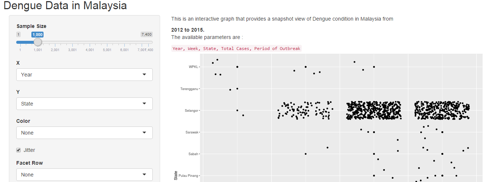

## Developing Data Products

Assignment - Developing Data Products:

Dengue Data in Malaysia : 2012-2015

---

## Introduction


This is a Real Time data visualization and analysis application based on Dengue data tabulated in Malaysia from 2012 - 2015. This presentation pack aims to provide a better understanding of the application and its intended usage. The following slides contain:
* Data Source: A brief overview of the data source
* Data Analysis: A screen capture of how the interactive plot looks like
* More information

---

## Data Source

The data is a tabulation of Dengue outbreak in Malaysia recorded between 2012 to 2015. 
The dataset is a small one consisting of **5 variables** and **7400 observations**. The 5 variable are:
* Year
* Week
* State
* Total Cases and
* Period of Outbreak

The dataset is taken from http://data.gov.my

---

## Data Analysis

The interactive data analysis app was developed using ShinyApp and it is hosted in https://meisin.shinyapps.io/dengue/

The widgets allow user to explore the dataset and understand Dengue trend better in Malaysia: *sliderbar*, *Dropdown boxes*, and *Checkbox*.



---

## More information

The R libraries used are:

```r
library(shiny)
library(ggplot2)
```
The *ui.R* and *server.R* files are stored on my github repository:
https://github.com/meisin/Developing-Data-Products


